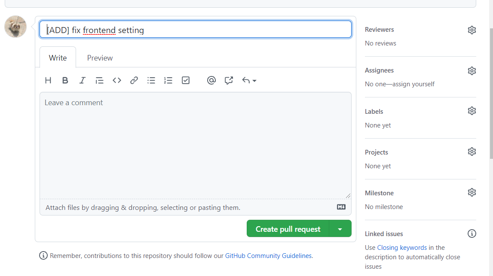
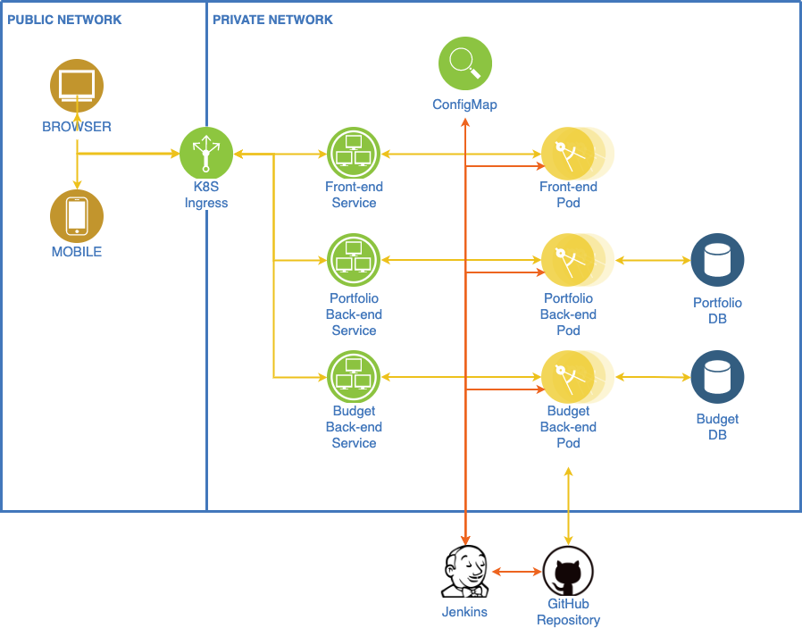

# README

> [1. 전국구팀 머니마니 서비스](#1.-전국구팀-"머니마니"-서비스)
>
> [2. Git](#2.-Git)

## 1. 전국구팀 "머니마니" 서비스

1. 서비스 목표
   - 자산관리를 하고 싶은 고객을 위해, 고객에게 맞는 솔루션을 제공해주어, 자산축적에 효율성을 향상시킴
2. Sprint 목표
   - 자산관리에 어려움을 겪는 고객에게, 고객의 목표와 상황에 맞는 포트폴리오와 예산을 추천하고, 자산관리를 효율적으로 하기 위한 정보를 제공해줌
3. 성공기준
   - 고객 연령, 자산, 목표금액과 목표기간에 맞는 포트폴리오를 추천해주는 서비스
   - 고객에게 맞는 한달 예산 금액을 추천해주고 지출관리를 해주는 서비스
4. 주요일정
   - Sprint Planning : 10/18
   - 개발 : 10/18-10/22
   - Review / Retrospective : 10/22
5. R&R
   - Project Owner: 솨
   - Scrum Master : 시니
   - 개발자
     - FE : 솨, 가위
     - BE : 쓱이, 옹쿠니, 시니
     - AI : 두깨
   - UI/UX : 솨, 가위
   - DevOps : 쓱이
   - 통합테스터 : 시니, 두깨
6. 이해관계자 및 관련조직
   - 스폰서 : DT전략부 조영서 전무님
   - Steering Commitee: 박형주 부장님, 조수덕 수석차장님
   - 관련조직 : 상품기획팀, 개발1팀, IT기획팀
7. 제약사항 / 예상위험
   - 고객에 맞는 AI추천 정확성
   - 마이데이터


## 2. Git

1. `git clone`

```sh
$ git clone https://github.com/KB-37-Paldo/paldo.git
```

2. 현재 `develop` 브랜치가 `default` 브랜치입니다.
3. 각 기능을 개발할 때는 `feature` 브랜치를 생성해 바로 이동 됩니다.

```sh
$ git checkout -b fe(or be)/feature/(기능이름)
```

4. 해당 브랜치에서 개발을 완료한 후 push합니다.

```sh
$ git add .
$ git commit -m'커밋메세지(해당 개발 코드가 어떤 코드인지 영어로 적기)'
$ git push origin 브랜치이름적기
```

5. github에 가서 `Pull  requests`에 들어가 초록색 버튼 `merge conflict`를 누르고 develop에 머지를 합니다.
   - `Compare & pull request` -> `Create pull request` -> `Merge pull request` -> `Confirm merge`





6. develop branch로 넘어가 pull 받고 개발을 완료한 브랜치를 지웁니다.

```sh
$ git checkout develop
$ git pull origin develop # 변경사항 동기화
$ git branch -d 개발완료한 브랜치 이름
```

## 3. 전체 시스템 구조




## 4. 포트폴리오 서비스 ERD


## 5. 포트폴리오 서비스 API 명세

1) 포트폴리오 API

2) 자산 API

3) 추천 API

4) 유저 API
